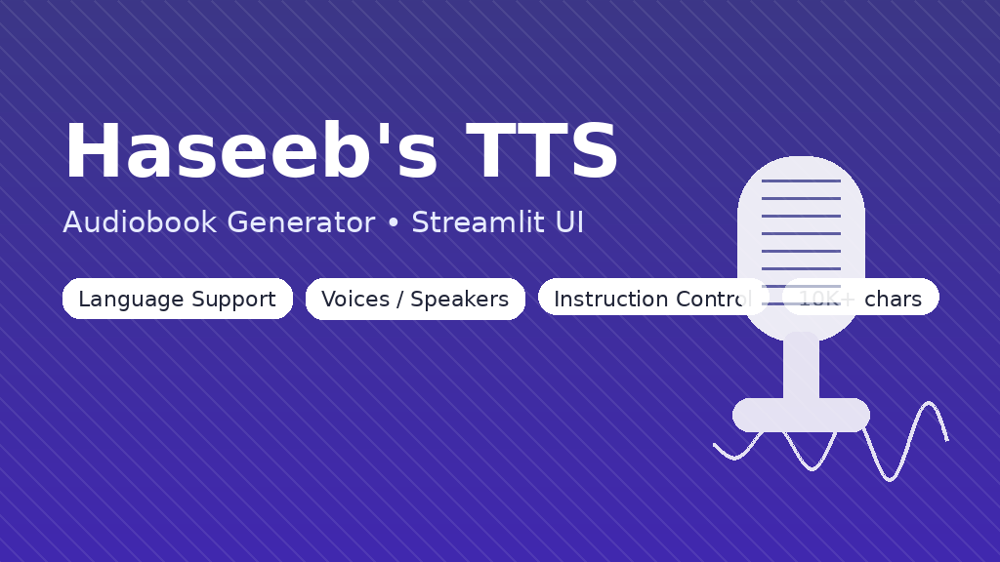
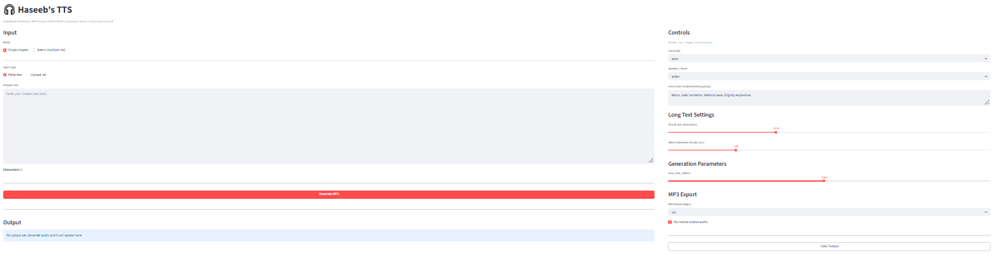

# 🎧 Haseeb’s TTS — Audiobook MP3 Generator

Turn long-form chapter text into **high-quality MP3 narration** with **language selection**, **speaker/voice control**, and **instruction-based narration style**.



## ✨ What it does
- Converts chapter text into **MP3 audiobook narration**
- Handles **10,000+ characters** using smart **chunking + seamless stitching**
- Supports **Instruction Control** (tone, pace, emotion)
- Supports **Language selection**
- Supports **Speaker / Voice selection**
- **Batch mode**: upload multiple `.txt` chapters → generate multiple MP3s → download as **ZIP**
- Persistent **Output Panel** for instant playback + downloads

## ✅ What makes it different
- Built specifically for **audiobook workflows**
- Designed for **long chapters** (not just short prompts)
- Batch processing + ZIP export = production-friendly
- Easy to deploy on Hugging Face Spaces or run locally on GPU

## 🧠 Model
- `Qwen/Qwen3-TTS-12Hz-1.7B-CustomVoice`

## 🧰 Tech Stack
- Python, Streamlit
- qwen-tts + PyTorch
- NumPy, SoundFile
- lameenc (MP3 encoding)


## 🔗 Live Demo (Hugging Face Space)
Check the deployed app here: https://huggingface.co/spaces/Jekyll2000/MY_TTS

## 🖼️ UI Preview



## 🚀 Run locally

### 1) Create environment
```bash
python3.10 -m venv .venv
source .venv/bin/activate
pip install -U pip
